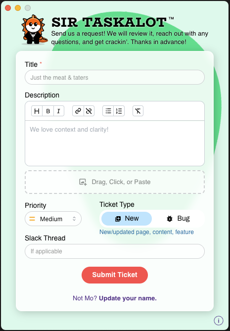

<h1 align="left" style="display:flex; align-items:center; gap:0.5rem;">
  <strong style="font-size:2rem;">Sir Taskalot</strong>
  
</h1>

_Making internal work requests magical (and stupid simple)_

  

<hr />

Sir Taskalot is a focused, delightful desktop app for **non-technical team members** to submit tickets — with no context switching, no clunky Jira fields, and no Slack confusion.

Requests submitted through this app are instantly routed to Slack (for visibility) and Jira (for tracking), with formatting and metadata handled automagically in the background.

> _"Make kindness normal. Make ticketing invisible."_ — Dennis Rodman

---

## ✨ Why?

Our goal is simple: **remove every possible barrier** to getting support, submitting ideas, and communicating work between teams.

- No need to log into Jira or learn its interface
- No need to worry about ticket formatting or field selection
- No need to remember Slack threads or who to tag

Just fill out a tiny form and hit submit. Sir Taskalot handles the rest.

---

## 🚀 Getting Started (for Developers)

To run the app locally:

```bash
npm install
npm run dev
```

To build a production variation for desktop install:

```bash 
npm run dist
```

## ✅ Environment Variables

Follow the schema of `.env.example` to build your own `.env` file (this will change the "Reporter" output in Jira):

```env
VITE_SLACK_TEST_CHANNEL_WEBHOOK_URL=https://hooks.slack.com/services/...
VITE_JIRA_API_TOKEN=your-jira-api-token
VITE_JIRA_EMAIL=your-jira-email@example.com
...
```

## 🧪 Tech Stack

- Vite + React
- Electron (Chromium app runtime)
- Mantine (component system)
- Slack Webhooks + Jira REST API

## 🐉 Author

**Chris “Mo” Mochinski**  
<sub style="color:gray"><a href="https://chrismochinski.github.io/">Wreck Shop Media</a></sub>  
<sub style="color:gray"><a href="https://characterstrong.com/">CharacterStrong</a></sub>

